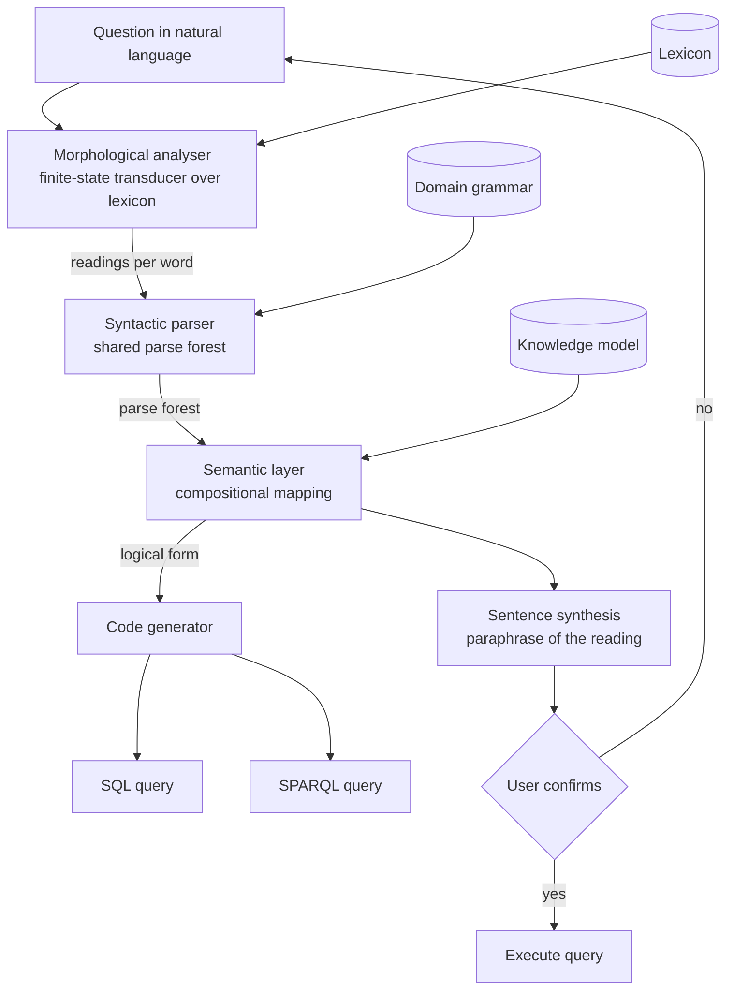

# Lexicon

A natural language interface that compiles questions into formal queries. Course project for
**Natural Language Interface**, Faculty of Computer Systems and Technologies, Technical
University of Sofia.

## What it is

Lexicon takes a question written in ordinary language and turns it into a formal query, either
SQL or SPARQL, against a described domain. It does this symbolically: morphological analysis,
syntactic parsing, semantic mapping, then code generation. Before running anything, it
paraphrases the question back to you in ordinary language, so you can see what it understood
and confirm or reject that reading.

## Goals

- Analyse an input word form into lemma plus grammatical features using a finite-state transducer over a lexicon.
- Parse a sentence into a shared parse forest, keeping every reading that the grammar allows.
- Map each parse tree compositionally onto a logical form over a knowledge representation.
- Emit a valid SQL query and a valid SPARQL query from the same logical form.
- Synthesise a natural language paraphrase of the interpreted question and require confirmation before execution.
- Measure the system against a large language model baseline on one frozen question set.

## Technologies

| Technology | Version or standard | Why |
| --- | --- | --- |
| C++ | C++20 | `std::span` and `std::string_view` let the whole pipeline work over views into the input with no copying; `constexpr` moves table construction to compile time. |
| CMake | 3.20 or newer | Standard build for a C++ library plus a CLI plus tests, with presets for the toolchains in use. |
| GoogleTest | 1.14 or newer | Per-layer unit tests and end-to-end tests over the same question set as the experiment. |
| SQLite | 3.x | Runs the generated SQL against real data so the query can be checked by its result, not by its text. |
| SPARQL | W3C Recommendation, 1.1 | Second target language, so the same logical form is proven to be independent of one query language. |

## Architecture

Five stages. The first four are a pipeline from text to query. The fifth hangs off the semantic
representation and runs backwards, reusing the morphological transducer for inflection and the
grammar for word order. Ambiguity is carried upward rather than resolved early: readings that
map onto nothing in the knowledge model are dropped by the semantic layer, which is where
disambiguation actually happens.



## Build

There is no `CMakeLists.txt` yet, so there is nothing to compile. `src/`, `include/`,
`data/` and `tests/` are empty placeholders. Once the first layer lands, the build will be:

```bash
cmake -S . -B build -DCMAKE_BUILD_TYPE=Release
cmake --build build -j
ctest --test-dir build --output-on-failure
```

The report in `docs/` builds today, see below.

## Documentation

The project report lives in `docs/`. It is written in Bulgarian, because the subject is taught
in Bulgarian and the layout is normative for the faculty. Build it with:

```bash
cd docs
latexmk -pdf Main.tex
```

Output lands in `docs/build/Main.pdf`. The formatting in `docs/preamble.tex` follows the
TU-Sofia FKST rules for page size, margins, typography, heading levels, table and figure
captions, so it should not be adjusted to taste. Unfilled facts are marked with `\TODO{...}`
and can be listed with:

```bash
grep -rn 'TODO' docs/chapters docs/Main.tex docs/references.bib
```

## Status

- [x] Repository scaffold and report skeleton
- [x] Bibliography of verified sources
- [ ] CMake build configuration
- [ ] Lexicon format and initial lexicon
- [ ] Morphological analyser
- [ ] Domain grammar
- [ ] Syntactic parser
- [ ] Semantic layer and logical form
- [ ] SQL generator
- [ ] SPARQL generator
- [ ] Sentence synthesis and confirmation loop
- [ ] Frozen question set and reference queries
- [ ] Baseline comparison run
- [ ] Report chapters filled in, no `\TODO` markers left

No implementation code exists yet. Everything below the first two items is unstarted.

## License

MIT. See [LICENSE](LICENSE).
