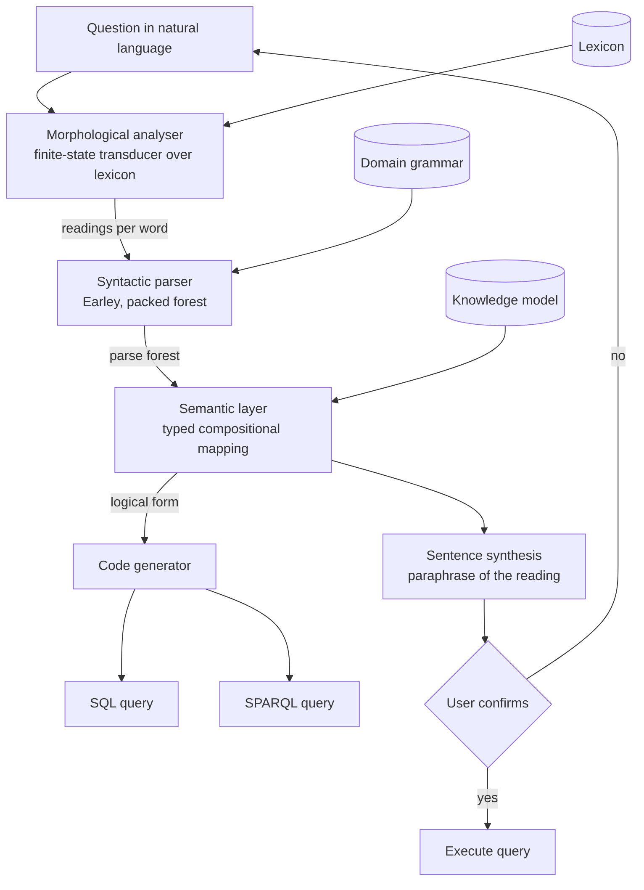

# Lexicon

A natural language interface that compiles questions into formal queries. Course project for
**Natural Language Interface**, Faculty of Computer Systems and Technologies, Technical
University of Sofia.

## What it is

Lexicon takes a question written in ordinary language and turns it into a formal query, either
SQL or SPARQL, against a described domain. It does this symbolically: morphological analysis,
syntactic parsing, semantic mapping, then code generation. Before running anything, it
paraphrases the question back to you in ordinary language, so you can see what it understood
and confirm or reject that reading.

```
$ ./build/lexicon --question "Which films with actors from France did Nolan direct?"
```

```
2. PARSE FOREST
   derivations       2
   forest nodes      28
   ambiguity points  1

3. READINGS
   reading 1: kept, attachment cost 4
      select x0 where Film(x0) & Person(x1) & acted_in(x1, x0) & film_country(x0, c_france)
                    & directed(p_nolan, x0)
   reading 2: kept, attachment cost 2
      select x0 where Film(x0) & Person(x1) & person_country(x1, c_france) & acted_in(x1, x0)
                    & directed(p_nolan, x0)

4. CHOSEN READING
   2 derivation(s), 2 mapped onto the model, 2 distinct logical form(s); chose reading 2 with
   attachment cost 2, the closest attachment among the surviving readings

8. PARAPHRASE BACK TO ENGLISH
   You are asking for the films with actors from France that were directed by Christopher Nolan.

9. ANSWER FROM THE BUNDLED KNOWLEDGE BASE
   Inception
```

The country can belong to the actors or to the films. The knowledge model has a relation for
both, so both readings survive, and the system says which one it took and why.

## Goals

- Analyse a word form into lemma plus grammatical features using a finite state transducer over a lexicon.
- Parse a sentence into a shared parse forest, keeping every reading the grammar allows.
- Map each parse tree compositionally onto a logical form over a knowledge model.
- Emit a valid SQL query and a valid SPARQL query from the same logical form.
- Synthesise a natural language paraphrase of the interpreted question before anything is executed.

## Dependencies

None. A C++20 compiler and CMake 3.20 are enough. There is no package manager step, no network
fetch at configure time, and no optional feature that quietly disappears.

The test runner is 58 lines in `tests/check.cpp` plus a 64 line header, the timing harness uses
`std::chrono::steady_clock`, and the knowledge base is a text file read at startup. Python is
needed only by `tools/check_sql.py`, which is a check on the generated SQL, not part of the
build.

## Build

```bash
cmake -S . -B build -G Ninja -DCMAKE_BUILD_TYPE=Release
cmake --build build
ctest --test-dir build --output-on-failure
```

Verified with g++ 15.2.0 (MinGW-w64) on Windows, CMake 4.3.2, Ninja 1.13.2. 30 test cases, each
registered with CTest separately so a failure names the case that broke. `-G Ninja` is a
preference, not a requirement.

## Run

```bash
cmake --build build --target demo             # every stage, for the whole question set
./build/lexicon --question "Who directed Inception?"
./build/lexicon --bulgarian                   # the small Bulgarian lexicon
./build/lexicon_bench                         # the measurements in the report
```

Other switches: `--emit-sql-schema` writes the relational schema and the data as SQL,
`--emit-turtle` writes the same facts as RDF, and `--machine` writes a flat record per question
for tooling.

To check that the generated SQL really answers the question, run it against SQLite and compare
it with the evaluator that works directly on the logical form:

```bash
python tools/check_sql.py build/lexicon
```

The last recorded run: 22 of 22 generated queries returned exactly what the evaluator returned,
including the negations and the relational division that comes out of "every".

## Architecture

Five stages. The first four are a pipeline from text to query. The fifth hangs off the semantic
representation and runs backwards, reusing the morphological transducer for inflection.
Ambiguity is carried upward rather than resolved early: readings that map onto nothing in the
knowledge model are dropped by the semantic layer, which is where disambiguation happens.



| Directory | What is in it |
| --- | --- |
| `include/lexicon/`, `src/` | one header and one translation unit per layer |
| `data/` | lexicons, grammar, schema, knowledge base, question set |
| `apps/` | the demo and the benchmark |
| `tests/` | the test runner and the test cases |
| `tools/` | `check_sql.py` |
| `docs/` | the report, and the raw output of the measurements |

Everything the system knows is in `data/`. The grammar mentions no word, the lexicon mentions no
table, and the code generators mention no English.

## Documentation

The project report lives in `docs/`. It is written in Bulgarian, because the subject is taught
in Bulgarian and the layout is normative for the faculty. Build it with:

```bash
cd docs
latexmk -pdf Main.tex
```

Output lands in `docs/build/Main.pdf`. The formatting in `docs/preamble.tex` follows the
TU-Sofia FKST rules and should not be adjusted to taste. Unfilled facts are marked with
`\TODO{...}` and can be listed with:

```bash
grep -rn 'TODO' docs/chapters docs/Main.tex docs/references.bib
```

## Status

- [x] CMake build, no third party dependencies
- [x] Lexicon format, English lexicon, small Bulgarian lexicon
- [x] Morphological analyser and generator over one finite state transducer
- [x] Domain grammar and Earley parser with a packed forest
- [x] Semantic layer, typed logical form, quantifiers and negation
- [x] SQL generator, checked by execution against SQLite
- [x] SPARQL generator
- [x] Sentence synthesis
- [x] Frozen question set and measurements
- [x] Baseline comparison against a language model: **run**, and repeatable.
      `qwen2.5-coder:7b` (digest `dae161e27b0e`) through Ollama at temperature 0, seed 1.
      A local model is used precisely because the comparison needs a fixed model, version
      and settings: a hosted endpoint changes underneath you, a digest does not. Both
      conditions were run twice and every verdict matched.
      Compared by **execution equivalence**, not string equality: both queries run against
      the bundled database and the result sets are compared.
      Schema only: **5 of 25**. Schema plus the label values: **16 of 25**. The pipeline is
      handed a lexicon, so withholding labels from the model is not like for like; supplying
      them triples agreement, which puts the dominant failure in entity linking rather than
      query construction.
      Two of the remaining differences are a criterion artefact (`1`/`0` against `'Yes'`/`'No'`)
      and **three are questions this pipeline cannot answer at all**, where the model can.
      Reproduce: `python tools/llm_baseline.py --model qwen2.5-coder:7b [--with-labels]`.
      Raw output in `docs/measurements/llm_baseline_*.txt`.
      Scope: one small quantised local model, 25 questions, one hand written catalogue. It
      says nothing about frontier models.
- [ ] Report chapters filled in, no `\TODO` markers left

Known limits, stated plainly: the knowledge model has one `Person` type, so an actor and a
director are the same kind of thing; the grammar has no coordination and no relative clauses;
quantifier scope is fixed rather than computed; and the paraphrase separates sister modifiers
with "and", which is unambiguous but not always graceful.

## License

MIT. See [LICENSE](LICENSE).
